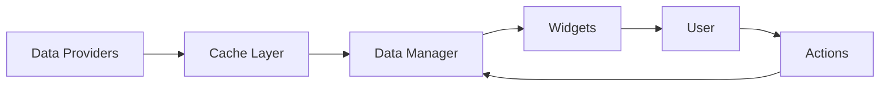

# Mira Trading Terminal - System Architecture

## Vision
Professional-grade trading terminal rivaling Bloomberg/TradingView with superior design and focused functionality.

## Core Principles
1. **Data First** - Reliable, cached, multi-source data pipeline
2. **Composable Widgets** - Modular, reusable components
3. **Workspace Flexibility** - Dockable, customizable layouts
4. **Design Excellence** - Sophisticated monochromatic aesthetic
5. **Performance** - Sub-100ms data updates, smooth UI

## Architecture Layers

### 1. Data Layer
```
providers/
├── alpaca/          # Real-time market data
├── polygon/         # Fundamentals & historical
├── sec/            # SEC filings
└── cache/          # Local SQLite cache
```

### 2. Business Logic Layer
```
core/
├── data_manager    # Unified data access
├── analysis/       # Calculations, indicators
├── workspace/      # State management
└── sync/          # Cross-widget communication
```

### 3. Presentation Layer
```
widgets/
├── market/         # Price, volume, charts
├── fundamental/    # Financials, ratios
├── research/       # News, filings
└── intelligence/   # AI insights
```

### 4. Application Layer
```
app/
├── main_window     # QMainWindow with docking
├── theme_engine    # Dynamic theming
└── shortcuts/      # Keyboard navigation
```

## Data Flow



## Key Decisions

### Tab/Workspace Strategy
**Decision Pending**: Context-based vs Symbol-focused

### Data Pipeline
- Primary: Alpaca (real-time)
- Secondary: Polygon (fundamentals)
- Tertiary: Direct SEC EDGAR
- Cache: SQLite with 5-min expiry

### Widget Communication
- Signal/Slot for UI updates
- Event bus for cross-widget sync
- Shared data manager instance

## Development Phases

### Phase 1: Foundation (Current)
- [ ] Tab/workspace architecture
- [ ] Data pipeline abstraction
- [ ] Core widget framework
- [ ] Caching layer

### Phase 2: Core Features
- [ ] Advanced charts
- [ ] Fundamental analysis
- [ ] Multi-symbol monitoring
- [ ] Workspace persistence

### Phase 3: Intelligence
- [ ] AI-powered insights
- [ ] Automated analysis
- [ ] Alert system
- [ ] Pattern recognition

## Performance Targets
- Data latency: <100ms
- UI frame rate: 60fps
- Memory usage: <500MB
- Startup time: <3 seconds

## Security Considerations
- API keys in environment variables
- Local cache encryption
- No sensitive data in logs
- Secure WebSocket connections

## Deployment Strategy
- Desktop: PyInstaller bundle
- Updates: Auto-updater with delta patches
- Licensing: Hardware-locked keys
- Analytics: Opt-in telemetry only